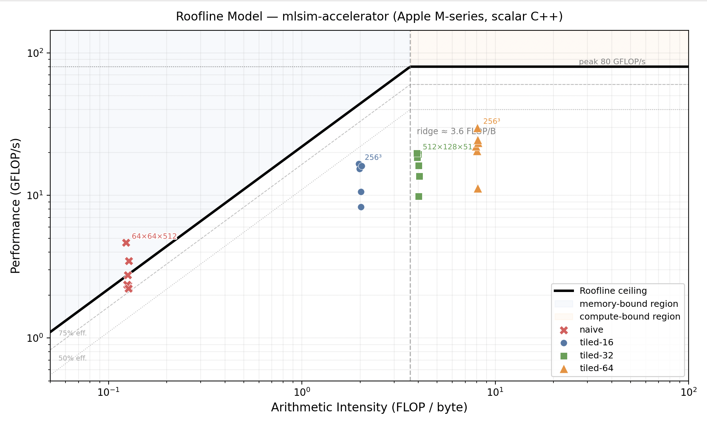

# Phase 1 — GEMM Roofline Analysis

## What is the roofline model?

The roofline model predicts an upper bound on achievable performance given two hardware limits:

- **Compute ceiling**: peak FLOP/s the CPU can sustain
- **Memory bandwidth ceiling**: peak bytes/s × arithmetic intensity

```
performance ≤ min(peak_FLOPS, peak_BW × AI)
```

**Arithmetic intensity (AI)** = FLOPs / bytes transferred from memory.

- Low AI → memory-bound (bandwidth is the bottleneck)
- High AI → compute-bound (FLOP/s is the bottleneck)
- The crossover is the **ridge point**: `peak_FLOPS / peak_BW`

---

## Memory traffic model

The AI values here use a **no-cache, worst-case model**: every array access is assumed to go to DRAM, and the C accumulator is not held in a register. This means the stated AIs are **conservative lower bounds** — actual AI on hardware is higher because:

1. Caches absorb A and B reuse (especially for tiled, which is designed to fit tiles in L1/L2)
2. The compiler keeps the C accumulator in a register, so real C traffic is 2×M×N (one read + one write per output element), not 2×M×K×N

Despite this, the model is useful for comparing naive vs tiled and for establishing where kernels sit on the roofline.

---

## FLOPs

For an M×K × K×N GEMM:

```
FLOPs = 2 × M × K × N    (one multiply + one add per (i, k, j) triple)
```

---

## Naive GEMM

Loop order: `i → j → k`

```cpp
for i in M:
  for j in N:
    for k in K:
      C[i,j] += A[i,k] * B[k,j]
```

Element access counts (worst-case, no cache):

| Array | Access pattern | Count |
|-------|---------------|-------|
| A[i,k] | re-read for every j | M×K×N |
| B[k,j] | re-read for every i | M×K×N |
| C[i,j] | read+written for every k | 2×M×N×K |
| **Total** | | **4×M×K×N** |

```
bytes = 4 × sizeof(float) × M×K×N = 16 × M×K×N

AI = 2×M×K×N / (16×M×K×N) = 0.125 FLOP/B
```

**AI = 0.125 FLOP/B — constant, independent of matrix size.**

---

## Tiled GEMM

Loop order: `i → j → k` (outer tiles), `ii → kk → jj` (inner, within tile)

```cpp
for i in 0..M step ts:
  for j in 0..N step ts:
    for k in 0..K step ts:
      for ii in i..i+ts:
        for kk in k..k+ts:
          for jj in j..j+ts:          // jj innermost: stride-1 access to B
            C[ii,jj] += A[ii,kk] * B[kk,jj]
```

The inner loop order `ii → kk → jj` is chosen deliberately:
- `jj` innermost: `B[kk*N + jj]` increments by 1 → sequential, prefetcher-friendly
- `kk` middle: `A[ii*K + kk]` is constant across the entire `jj` loop → stays in a register, zero memory traffic

Each tile is loaded once per outer tile iteration. With tile size `ts`:

| Array | Reuse factor | Total element loads |
|-------|-------------|-------------------|
| A tile (ts×ts) | reused across N/ts j-tiles | M×K×N/ts |
| B tile (ts×ts) | reused across M/ts i-tiles | M×K×N/ts |
| C tile (ts×ts) | read+written K/ts times | 2×M×K×N/ts |
| **Total** | | **4×M×K×N/ts** |

```
bytes = 4 × sizeof(float) × M×K×N / ts = 16 × M×K×N / ts

AI = 2×M×K×N / (16×M×K×N/ts) = ts/8 FLOP/B
```

**AI = ts/8 FLOP/B — depends only on tile size, not matrix shape.**

Note: the formula assumes M, K, N are multiples of `ts`. All benchmark configs satisfy this.

| tile size | AI (FLOP/B) |
|-----------|------------|
| 16 | 2.0 |
| 32 | 4.0 |
| 64 | 8.0 |

---

## Machine ceilings (Apple M-series)

| Parameter | Value | Source |
|-----------|-------|--------|
| Peak GFLOP/s | 80.0 | Single-core FP32 with auto-vectorisation |
| Peak BW (GB/s) | 22.0 | Empirical: average naive GEMM bandwidth output (~21–28 GB/s measured). Naive is cache-thrashing so it approximates DRAM bandwidth. |
| Ridge point | ~3.6 FLOP/B | 80 ÷ 22 |

---

## Benchmark results

Measured on Apple M-series, `-O3 -march=native`. Reproduce with `cd golden && mkdir build && cd build && cmake .. && make && ./roofline`.

| M | K | N | Naive AI | Tiled-16 AI | Tiled-32 AI | Tiled-64 AI | Naive (GFLOP/s) | Tiled-64 (GFLOP/s) | Speedup |
|--:|--:|--:|---------:|------------:|------------:|------------:|----------------:|-------------------:|--------:|
| 64 | 64 | 64 | 0.125 | 2.0 | 4.0 | 8.0 | 2.64 | 17.19 | **6.5×** |
| 128 | 128 | 128 | 0.125 | 2.0 | 4.0 | 8.0 | 2.84 | 21.20 | **7.5×** |
| 256 | 256 | 256 | 0.125 | 2.0 | 4.0 | 8.0 | 2.96 | 30.89 | **10.4×** |
| 512 | 512 | 512 | 0.125 | 2.0 | 4.0 | 8.0 | 2.78 | 22.98 | **8.3×** |
| 64 | 64 | 512 | 0.125 | 2.0 | 4.0 | 8.0 | 4.82 | 27.57 | **5.7×** |
| 512 | 128 | 512 | 0.125 | 2.0 | 4.0 | 8.0 | 3.60 | 24.82 | **6.9×** |

<details>
<summary>Full tile-size sweep (raw output)</summary>

```
=== M=64  K=64  N=64 ===
    M    K    N   tile       ms    GFLOP/s       GB/s  AI(FLOP/B)
-----------------------------------------------------------------
   64   64   64  naive     0.20       2.64      21.12       0.125
   64   64   64     16     0.06       9.36       4.68       2.000
   64   64   64     32     0.05      11.09       2.77       4.000
   64   64   64     64     0.03      17.19       2.15       8.000

=== M=128  K=128  N=128 ===
    M    K    N   tile       ms    GFLOP/s       GB/s  AI(FLOP/B)
-----------------------------------------------------------------
  128  128  128  naive     1.48       2.84      22.69       0.125
  128  128  128     16     0.37      11.36       5.68       2.000
  128  128  128     32     0.32      13.17       3.29       4.000
  128  128  128     64     0.20      21.20       2.65       8.000

=== M=256  K=256  N=256 ===
    M    K    N   tile       ms    GFLOP/s       GB/s  AI(FLOP/B)
-----------------------------------------------------------------
  256  256  256  naive    11.34       2.96      23.67       0.125
  256  256  256     16     2.02      16.65       8.32       2.000
  256  256  256     32     1.67      20.06       5.02       4.000
  256  256  256     64     1.09      30.89       3.86       8.000

=== M=512  K=512  N=512 ===
    M    K    N   tile       ms    GFLOP/s       GB/s  AI(FLOP/B)
-----------------------------------------------------------------
  512  512  512  naive    96.64       2.78      22.22       0.125
  512  512  512     16    16.83      15.95       7.98       2.000
  512  512  512     32    14.12      19.01       4.75       4.000
  512  512  512     64    11.68      22.98       2.87       8.000

=== M=64  K=64  N=512 ===
    M    K    N   tile       ms    GFLOP/s       GB/s  AI(FLOP/B)
-----------------------------------------------------------------
   64   64  512  naive     0.87       4.82      38.59       0.125
   64   64  512     16     0.26      16.02       8.01       2.000
   64   64  512     32     0.21      19.83       4.96       4.000
   64   64  512     64     0.15      27.57       3.45       8.000

=== M=512  K=128  N=512 ===
    M    K    N   tile       ms    GFLOP/s       GB/s  AI(FLOP/B)
-----------------------------------------------------------------
  512  128  512  naive    18.64       3.60      28.81       0.125
  512  128  512     16     4.06      16.53       8.27       2.000
  512  128  512     32     3.41      19.68       4.92       4.000
  512  128  512     64     2.70      24.82       3.10       8.000
```
</details>

---

## Roofline plot



Generated by `analysis/roofline_plot.py`. The plot uses the no-cache AI values as x-coordinates, so all points are shifted left of their true hardware positions. The ridge point at 3.6 FLOP/B is derived empirically from the naive benchmark bandwidth.

**Takeaways:**
- **Tiled AI depends only on tile size, not matrix shape** — AI = ts/8 for float32; doubling the tile doubles the AI regardless of M, K, N.
- **Naive is permanently memory-bound** — 0.125 FLOP/B is a conservative lower bound, but even with register accumulation for C the true AI remains far below the ridge point (~3.6 FLOP/B).
- **tile=64 crosses the ridge point** — at 8.0 FLOP/B it sits in the compute-bound region, explaining the 6.5–10.4× speedup over naive.
- **Remaining gap to peak** — even tiled-64 reaches at most ~31 GFLOP/s vs 80 GFLOP/s peak. It is single-threaded scalar; AVX/AMX or multi-threading are the next levers (future phases).
